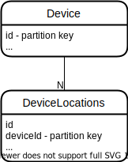

# Notes

Perf testing is always tricky. Here are some
numbers with *very* **very** limited testing.
Your mileage *will* vary.

## Setup

This test setup has been done with Cosmos DB account and
Virtual Machine hosted in same Azure Region.

VM has been provisioned with following specs:

- Size: Standard D4s_v4 (4 vcpus, 16 GiB memory)
- Accelerated Networking: Enabled
- Connection from VM to Cosmos DB is via Service endpoint

For latency check you can use `psping` ([download](https://docs.microsoft.com/en-us/sysinternals/downloads/psping)):

```bash
# psping -t yourcosmosdbaccount.documents.azure.com:443

PsPing v2.10 - PsPing - ping, latency, bandwidth measurement utility
Copyright (C) 2012-2016 Mark Russinovich
Sysinternals - www.sysinternals.com

TCP connect to 13.69.126.21:443:
Infinite iterations (warmup 1) ping test:
Connecting to 13.69.126.21:443 (warmup): from 172.16.2.4:50762: 1.37ms
Connecting to 13.69.126.21:443: from 172.16.2.4:50763: 1.21ms
Connecting to 13.69.126.21:443: from 172.16.2.4:50764: 1.26ms
Connecting to 13.69.126.21:443: from 172.16.2.4:50765: 1.40ms
Connecting to 13.69.126.21:443: from 172.16.2.4:50766: 1.46ms
Connecting to 13.69.126.21:443: from 172.16.2.4:50767: 1.37ms
Connecting to 13.69.126.21:443: from 172.16.2.4:50768: 1.28ms
Connecting to 13.69.126.21:443: from 172.16.2.4:50769: 1.21ms
Connecting to 13.69.126.21:443: from 172.16.2.4:50771: 1.33ms
Connecting to 13.69.126.21:443: from 172.16.2.4:50772: 1.32ms
Connecting to 13.69.126.21:443: from 172.16.2.4:50773: 1.28ms

  Sent = 10, Received = 10, Lost = 0 (0% loss),
  Minimum = 1.21ms, Maximum = 1.46ms, Average = 1.31ms
```

## Test scenarios

**Note:** All times in seconds are rounded up to the closest second.
Similarly, `documents/seconds` is rounded to the closest hundred or thousand.

### Write

In this test scenario you want to write documents as fast as possible to the Cosmos DB.

- Write 100'000 documents
- Partition key = Item id
- Document size is small (< 1 KB)

Simplified C# part:

```csharp
_client = new CosmosClient(connectionString, new CosmosClientOptions() { AllowBulkExecution = true });

// Create new with 'id':
var partitionKey = new PartitionKey(id);
var device = new Device()
{
    ID = id,
    Name = $"Device {item}",
    Current = new Location()
    // ...other fields
};

var stream = new MemoryStream();
await JsonSerializer.SerializeAsync(stream, device);
tasks.Add(_devicesContainer.CreateItemStreamAsync(stream, partitionKey));

// Wait processing to finish
await Task.WhenAll(tasks);
```

Example run stats:

| RUs     | Time (seconds) | Documents/second |
|---------|----------------|------------------|
| 10'000  | 60             | 1'700            |
| 25'000  | 28             | 3'600            |
| 50'000  | 18             | 5'500            |
| 100'000 | 9              | 11'000           |
| 200'000 | 8              | 12'000           |
| 400'000 | 5              | 20'000           |

### Delete with id and partition key

In this test scenario you want to delete documents as fast as possible from the Cosmos DB
*and* you know the items that you want to delete. 

- Delete 100'000 documents
- Partition key = Item id
- Document size is small (< 1 KB)

Simplified C# part:

```csharp
_client = new CosmosClient(connectionString, new CosmosClientOptions() { AllowBulkExecution = true });

// Delete item with 'id':
var partitionKey = new PartitionKey(id);
tasks.Add(_devicesContainer.DeleteItemStreamAsync(id, partitionKey));

// Wait processing to finish
await Task.WhenAll(tasks);
```

Performance between this scenario and previous one are in the same ballpark figures.

### Querying data

In case we don't know identifiers then we need to query them.
Let's try to analyze following scenario:



If we need to delete both `Device` and it's related `DeviceLocations` data,
but we don't know item identifiers of the `DeviceLocations` data, then we need
to query that data one-by-one.

Simplified C# part:

```csharp
using var queryIterator = _deviceLocationsContainer.GetItemQueryIterator<QueryResponseID>("SELECT c.id FROM c", null,
  new QueryRequestOptions()
  {
    PartitionKey = new PartitionKey(deviceId.ToString())
  });

while (queryIterator.HasMoreResults)
{
  var response = await queryIterator.ReadNextAsync();
  foreach (var item in response)
  {
    // Store identifier for later clean up purposes.
  }
}
```

Alternative stream iterator version:

```csharp
using var queryIterator = _deviceLocationsContainer.GetItemQueryStreamIterator("SELECT c.id FROM c", null,
    new QueryRequestOptions()
    {
        PartitionKey = new PartitionKey(deviceId.ToString())
    });
while (queryIterator2.HasMoreResults)
{
    using var response = await queryIterator.ReadNextAsync();
    var queryResponse = await JsonSerializer.DeserializeAsync<QueryResponse>(response.Content);
}
```

Unfortunately, above is quite slow in terms of enabling mass deletion of items.

If you have received this dataset from external system, then you might want to get export from
the source system to ease up the bulk delete. It can be as simple as following `CSV`:

```csv
DeviceID,DeviceLocationID
1,a
1,b
2,c
2,d
```

Above dataset can be then used with bulk delete streaming api for deleting
item data as fast as possible.
